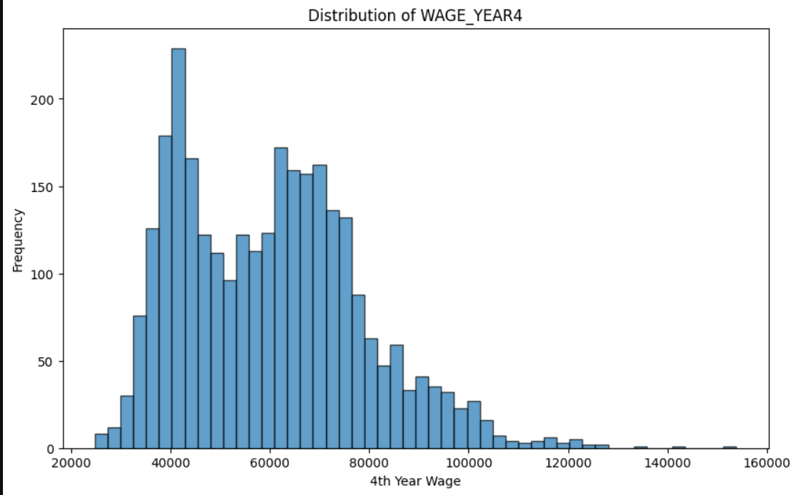
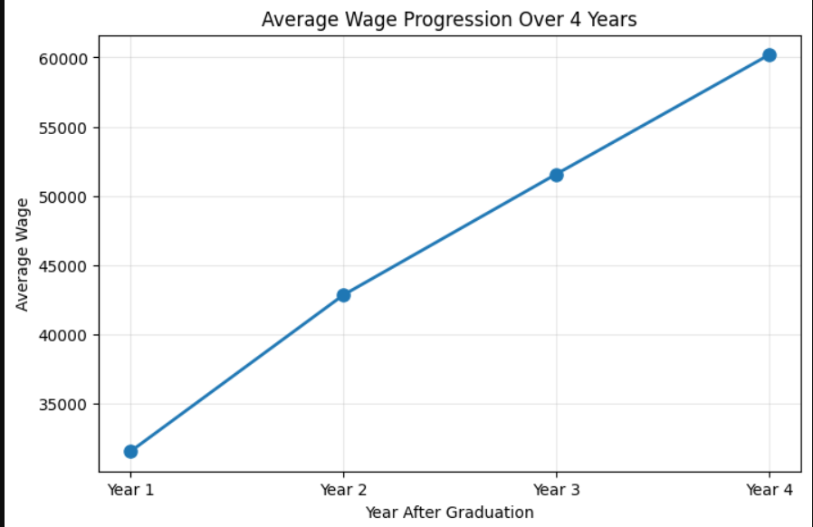
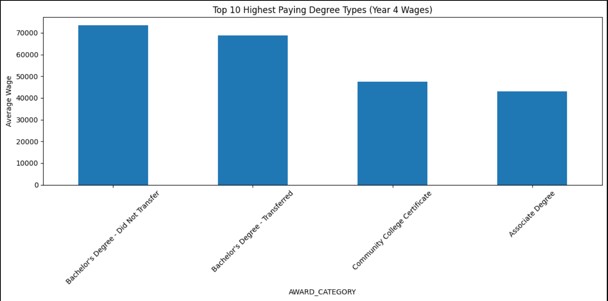

PART 1 ANSWERS
Data Quality- The dataset includes categorical columns (district type, name, year, demographics, population, and award type) and numeric columns (district code and wages for years 1–4). Only the district code column has missing values (2,745), and all other columns are complete. Most wage entries are zero (about 17,770 per year), which likely indicates missing or unreported data rather than actual $0 salaries.

Range Analysis- Categorical columns have a limited number of unique values. For example, district type has three options, and award category has four types of degrees. Wages vary widely: Year 4 wages range from $0 to about $153,910, with an average of $8,530. Most distributions are heavily skewed due to many zeros.

Semantics- This data shows institution-level wage outcomes for different degree types and demographic groups. The type of degree has the biggest influence on wages, with bachelor’s degrees generally paying more than associate degrees or certificates. Wages also tend to increase over the four years after graduation, and there are some differences between demographic groups and districts.

Visualizations-

Links to collab notebooks:
Part 1- https://colab.research.google.com/drive/1rlQUb7Kf1raNUBoUcvsYkPfywSDIyZLV?usp=sharing
Part 2- https://colab.research.google.com/drive/1xKVjqp1x2QniRqPYSVJ4k7HUmwnOPxHt?usp=sharing
